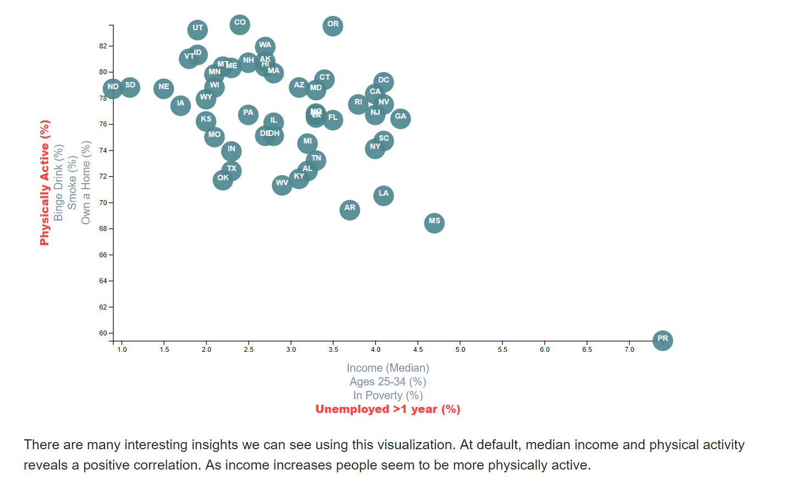

# data-journalism
In this Data Driven Document, I have explored certain associations between demographics and behavioral risk factors using survey data collected from the American Community Survey (ACS) and the Behavioral Risk Factor Surveillance System (BRFSS) during the year 2014.

## Webpage:
* https://risky-health.herokuapp.com

## Technology Stack: 
Python 3.6 
Flask framework 
Javascript 
HTML/CSS/Bootstrap 

## Data Sources:
* https://factfinder.census.gov/faces/nav/jsf/pages/searchresults.xhtml
* https://chronicdata.cdc.gov/Behavioral-Risk-Factors/BRFSS-2014-Overall/5ra3-ixqq

## License
[MIT](LICENSE) © Justin Le